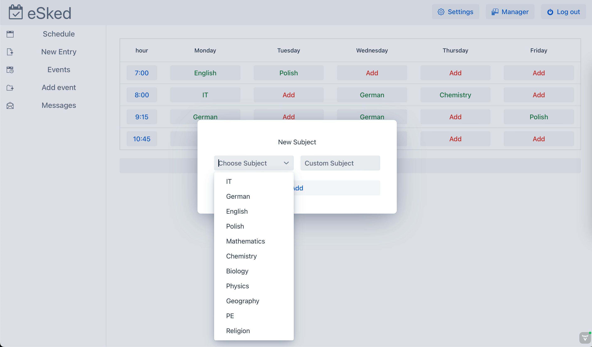

# eSked
### Calendar and organizer for students
## Used Technologies
 - Maven based project
 - Vaadin 24 for UI
 - Spring boot webserver
 - Accessing h2 database through JPA
 - Jakata Mail service for mailing 

## Features
- Full app security with users stored in database
- Information encryption services
- Token based forgotten password change
- Users, groups, events structures with services responsible
- Application theme switching
- Application is fully I18 translated in English and Polish

## Screenshots

## Disclaimer
passwords.properties has to be supplied to resources for app to start